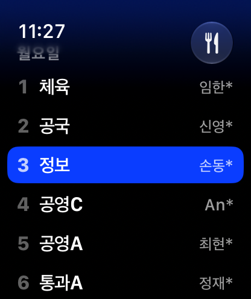
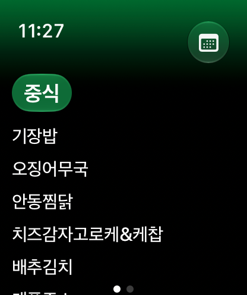
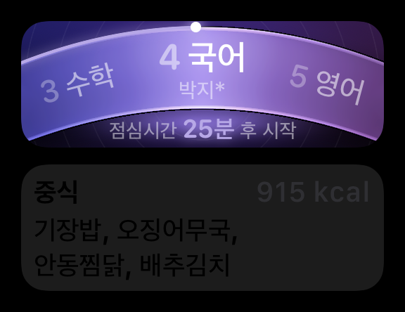

# TimeforSchool

A watchOS app that shows one class's daily timetable and school meals. Data
comes from the [timefor.school](https://api.timefor.school) API. The app is
fixed to school code `7010208`, grade 1, class 3. There is no settings screen.

It is a standalone watch app (`WKWatchOnly`): there is no iOS companion target,
and it installs and runs on the watch alone. Bundle identifiers are namespaced
under `school.timefor.watch` so `school.timefor` stays free for an iOS app
later.

## Requirements

- Xcode 27 (watchOS 27 SDK)
- [XcodeGen](https://github.com/yonaskolb/XcodeGen)
- Deployment target: watchOS 27.0, Swift 6 language mode

## Build

```
xcodegen generate
```

```
xcodebuild -project TimeforSchool.xcodeproj -scheme TimeforSchool -destination 'platform=watchOS Simulator,name=Apple Watch Series 11 (46mm)' build
```

`TimeforSchool.xcodeproj` is generated from `project.yml`. Edit `project.yml`
and re-run `xcodegen generate` after adding or removing files.

## Screens

The app is a vertical-page `TabView` with two pages, navigated with the Digital
Crown.

### Timetable



Lists every period of the school day in three columns: period number, subject,
teacher. Rows are not interactive. The teacher column width is measured from
the widest name in the day, so the columns align down the list.

One marker shows the current position in the day:

| State | Marker |
| --- | --- |
| Inside a lesson | That row is filled blue |
| Between lessons | A 2 pt blue rule in the gap between the two rows |
| Before the first lesson | A blue dot above the list |
| After the last lesson | A blue dot below the list |

The break rule occupies no layout height, so rows do not shift when a break
starts. Current lesson rows and break rules are centred when the screen opens;
the start and end dots rest at the natural top and bottom edges. Repositioning
is skipped while the list is being scrolled and applied once scrolling stops.

After 17:00, and all weekend, the page shows the next school day and flags it
in yellow. Lessons marked as replaced by the API are shown in yellow.

The screen re-evaluates once a minute through `TimelineView(.everyMinute)`.

### Meals



Two horizontal pages, 중식 and 석식, each a single column of dishes with the
calorie count at the end.

- Before 13:10, today's 중식 leads when it is published; otherwise the earliest
  available service leads.
- After 13:10, 중식 rolls over to its next published day while an available
  dinner remains on today.
- After 18:40, 석식 rolls over as well and the earliest actual future service
  leads (normally the next day's 중식).
- Each service skips its own unpublished days, so a lunch-only day never
  invents dinner. A known empty response remains an honest empty state rather
  than claiming tomorrow has food.

A rolled-over page is flagged `내일`, or with the date when the next served day
is further out.

## Widgets



Two widgets in one extension, both supporting the Smart Stack and watch face
complications.

**다음 수업** — families: `accessoryCircular`, `accessoryCorner`,
`accessoryInline`, `accessoryRectangular`.

The rectangular Smart Stack card is a short run of the day rather than a single
row: three lessons ride a lit glass arch, the one in focus held at the crest
with its teacher under it, its neighbours dim and turned to the arch's own
tangent where they stand. A marker rides the leading edge at the wearer's
position, trailing a lit rim over the part of the day already behind them. The
whole card takes its hue from how far through the day the focus sits — cool at
the first period, warm by the last.

Every measurement is a fraction of the card's height, and the same parabola
places the band and centres the lessons standing on it, so nothing floats off
the band it belongs to at any watch size.

A subject is set at whatever size holds it whole, in three steps: full size
over the teacher, smaller but still over the teacher, then two lines with the
teacher given up. Below that floor it is cut with an ellipsis rather than shrunk
further. Anything past ten characters is cut on principle — the feed sometimes
carries a whole course title where a subject belongs, and the opening of the
name says more than all of it set too small to read. The timetable list keeps
the full name; it has the width for it. The period number is set from the same fitted size as the subject
beside it, so it never ends up larger than the word it labels. Korean only
breaks lines at spaces, so a subject written as one run — 국제사회문화탐구 — is
given zero-width breaks and wraps between characters.

One line under the crest says what the wearer is waiting for. A lesson in
progress counts down to what comes after it, not to its own bell — 점심시간
25분 후 시작 — because the answer wanted in fourth period is how long until
lunch. A break counts down as itself: 점심시간 30분 남음. The day's last lesson
has nothing after it to name and counts down to its own end. Every line is
centred as one phrase.

Because the line counts whole minutes, the timeline carries one entry per minute
for the next hour, plus one entry at every bell time, and reloads to refill the
window.

The watch face complications are drawn separately: a face renders in a single
tint, where the arch and the neighbouring lessons would only muddy it, so those
layouts state one lesson plainly.

**급식** — families: `accessoryRectangular`, `accessoryInline`. Shows the next
published meal that has not been served, respecting separate lunch and dinner
availability. The timeline has entries at 13:10, 18:40 and midnight.

Both widgets declare `WidgetRelevance` so the Smart Stack surfaces them at the
right times: 07:30–17:00 for the timetable, 11:00–13:10 and 17:00–18:40 for
meals. Tapping either opens the matching page through a `timeforschool://` URL.

## Data and caching

`SchoolRepository` is the single entry point for both the app and the widget
extension. It reads from disk first and refreshes behind that result, so every
surface renders immediately and keeps working offline. Snapshots are JSON files
in the `group.school.timefor.watch` app group container, falling back to the caches
directory when the app group is unavailable.

- Timetable: refreshed when the cached copy is older than 4 hours or was
  fetched on an earlier day.
- Meals: a rolling 30-day window, refreshed when older than 12 hours or when it
  covers fewer than 7 days ahead. Menus are published weeks in advance, so
  tomorrow's meal is always already on disk.

The app reads its cached snapshots synchronously in `SchoolStore.init`, so the
first frame is already populated. Widget timelines are reloaded only when a
refresh actually returns new data.

The app group requires the App Group capability on the provisioning profile.
Without it the widget extension falls back to its own cache and fetches
independently.

## API

Two endpoints, both returning JSON:

```
GET /timetable?schoolcode=&grade=&classno=
GET /lunch?schoolcode=&grade=&classno=&startdate=&enddate=
```

Notes on the responses:

- `/timetable` returns `timetable` as five arrays, Monday to Friday, and
  `day_time` as period start times in the form `"5(13:10)"`. Period length is
  not published; the app uses a 50-minute constant.
- `/lunch` returns NEIS records. `MMEAL_SC_CODE` is `1` 조식, `2` 중식, `3` 석식.
  Only 중식 and 석식 are used.
- Subject names are upper-cased on the way in. A split class arrives as 사회b
  one week and 사회B the next, and the two would read as different subjects on
  a card that shows a single word.
- Dish names in `DDISH_NM` carry allergen markers: a trailing `y` on this
  school's feed, and sometimes the numeric `(1.5.6)` form. Both are stripped.
- When a date range contains no menu, `/lunch` responds `404` with
  `{"ok":false,"error":{"code":"NEIS_DATA_NOT_FOUND"}}`. This is the normal
  response over weekends and vacations and is treated as an empty, cacheable
  result, not an error.
- Date ranges may cross month boundaries.

## Project structure

```
Shared/                  compiled into both the app and the widget extension
  Model/                 Lesson, Meal, SchoolDate, SchoolWeek, SchoolIdentity
  Time/                  SchoolClock, BellSchedule, DayIndicator, presentation logic
  Networking/            SchoolAPI, DTOs, response cleanup
  Cache/                 SchoolRepository, SnapshotStorage, snapshot types
  Design/                Palette, Typography, Metrics
TimeforSchool Watch App/
  App/                   entry point, SchoolStore, RootView
  Features/Timetable/
  Features/Meals/
  Features/Shared/
TimeforSchoolWidgets/
  Complication/          다음 수업 widget
  Meals/                 급식 widget
```

All schedule logic lives in `Shared/Time`, so the app and both widgets resolve
the same state from the same code.

## Debug

In DEBUG builds, `TFS_TIME_OFFSET_MINUTES` shifts the clock the UI renders
against. This makes every state of the day reachable without waiting.

```
SIMCTL_CHILD_TFS_TIME_OFFSET_MINUTES=2124 xcrun simctl launch booted school.timefor.watch
```

`TFS_START_PAGE=meals` opens the app on the meal page. The watch simulator does
not route `timeforschool://` URLs, so this is the only way to reach that page
without tapping.

```
SIMCTL_CHILD_TFS_START_PAGE=meals xcrun simctl launch booted school.timefor.watch
```
